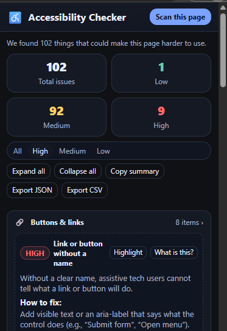

# Web Accessibility Checker ♿

A lightweight **Chrome (Manifest V3) extension** that scans the current page for common accessibility issues and explains them in **plain English** with clear fixes.  

It helps developers, designers, and testers quickly spot issues like missing alt text, poor color contrast, unlabeled form fields, and more. You can **filter by severity**, **highlight elements**, and **export reports** as CSV or JSON.

<p align="center">
  
</p>

---

## ✨ Features
- 🔎 **One-click scan** of any web page  
- 🗂️ **Grouped issues** (Images, Forms, Buttons/Links, Contrast, Focus, Page Settings)  
- 🚦 **Severity filters** (High / Medium / Low)  
- 💬 **Plain-English explanations** — *Why it matters* + *How to fix*  
- 🎯 **Click-to-highlight** problem elements directly on the page  
- 📤 **Export reports** to **CSV** (for QA/design/PM) and **JSON** (for dev/CI use)  
- 🎨 **Compact UI** with modular CSS (base, components, theme)  
- ☀️ Optional **light theme** (`body.light` toggle)  

---

## 🔍 What it checks (WCAG 2.x)
- **Image alt text** — 1.1.1  
- **Links/Buttons accessible name** — 4.1.2  
- **Form inputs labeled** — 3.3.2  
- **Color contrast** (text vs background) — 1.4.3 (AA heuristic)  
- **Visible keyboard focus** — 2.4.7  
- **Page language set (`<html lang>` )** — 3.1.1  

⚠️ *Note: Contrast checks are heuristic based on computed styles. Shadow DOM/iframes may be partially supported. This tool is an **aid**, not a certification.*  

---

## 🛠️ Installation (Developer Mode)
1. Clone or [download this repo](https://github.com/<your-username>/<repo-name>).
2. Go to `chrome://extensions` in Chrome.
3. Enable **Developer mode** (top-right).
4. Click **Load unpacked** and select the project folder.
5. Pin the extension → click it → **Scan this page**.

---

## 🧪 Test Pages
Try scanning these known accessibility test pages:
- **W3C BAD demo (before/after)**  
  - Bad: https://www.w3.org/WAI/demos/bad/before/home.html  
  - Fixed: https://www.w3.org/WAI/demos/bad/after/home.html  
- **Deque Mars demo**: https://dequeuniversity.com/demo/mars/  
- **WebAIM sample**: https://webaim.org/resources/evalsample/  
- **Page missing `lang`**: https://csstestsuite.github.io/tests/css21_bis/html4/002.html  

---

## 📁 Project Structure
```
accessibility-checker/
├─ manifest.json # Extension config (MV3)
├─ popup.html # UI markup
├─ popup.js # Popup logic (filters, export, highlight)
├─ content.js # Page checks (alt text, contrast, labels, etc.)
└─ styles/
├─ base.css # Base styling
├─ components.css # UI components
└─ theme.css # Dark/Light theme support
```
---

## 📤 Export Formats
- **CSV** (spreadsheet-friendly):  
- **JSON**: Raw structured output (ideal for CI pipelines).

---

## 🚀 Roadmap
- Suggest nearest **AA-compliant colors** for contrast issues  
- **Ignore list / Mark resolved** option  
- Add **heading hierarchy & skip-link checks**  
- Export only **filtered issues**  
- Optional integration with **axe-core** for deeper rules  

---

## 🔐 Privacy
- 100% client-side.  
- The extension **does not collect or transmit data**.  
- All analysis runs locally in your browser on the active page.  

## 📄 License
[MIT](LICENSE) © 2025

---
